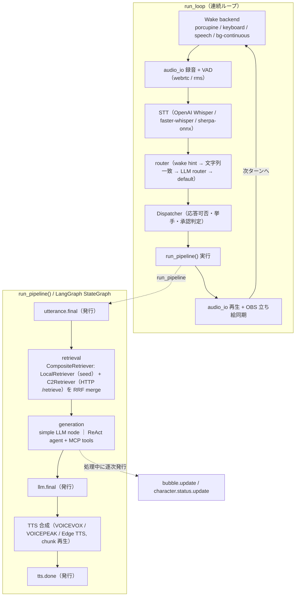

# aibyss-lab-lounge (L2)

A.I.byss Suite の **会話ランタイム**（港の現場を回す心臓部）。マイク音声やテキストを受け取り、
**STT → キャラクター・ルーティング → LLM → TTS** のパイプラインを実行し、その過程を
Event Bus (Redis Streams) に Event Envelope として publish する。複数キャラクターの協調、
挙手制の自発介入、MCP ツール、立ち絵連携 (OBS) までを束ねる。

> 深海×AI をテーマにした AITuber 配信を「反応するだけ」から「待ち感のない対話」へ。
> L2 は *崩れない配信体験* を支える低レイテンシ＆フォールバック重視のランタイム。

> **実装状況** (2026-05-25):
> - Walking Skeleton 〜 Real E2E 〜 Grounded E2E (RAG) — テキスト/音声エミッタ・real STT/LLM/TTS・seed corpus + C2 検索
> - **Axis A〜D** — マルチキャラクター・Porcupine ウェイクワード・意図ゲート・OBS 立ち絵・WebRTC VAD・C2 意味検索 (RRF merge)・フィラー・Agent 自律化 (LangGraph) + MCP ツール・faster-whisper
> - **Phase 0.5 系列** — 挙手制自発介入 (dispatcher 状態機械)・CharacterStatusManager (7 状態)・案 R リファクタ + dead code cleanup・bubble 3 系統分離・各種実走品質改善
> - テスト: **1082 passed**（警告 0 維持）

関連リポジトリ: [C2 = aibyss-coral-chronicle](https://github.com/think-ai-lab/aibyss-coral-chronicle)（歴史書 / RAG）・[V2 = aibyss-nautilus-v2](https://github.com/think-ai-lab/aibyss-nautilus-v2)（HUD）・[aibyss-workspace](https://github.com/think-ai-lab/aibyss-workspace)（港 / 共通スキーマ）。

---

## アーキテクチャ



編集可能な詳細図（run_loop ループ・pipeline ノード・Dispatcher / CharacterStatusManager 状態機械）:
[`../aibyss-workspace/docs/diagrams/lab-lounge-internals.drawio`](../aibyss-workspace/docs/diagrams/lab-lounge-internals.drawio)
（draw.io / diagrams.net・VS Code draw.io 拡張で開ける）

---

## セットアップ

### 前提

- Python 3.11 以上
- [uv](https://github.com/astral-sh/uv) がインストール済み
- `aibyss-workspace` が兄弟ディレクトリに clone 済み（Event Envelope スキーマの自動探索に使用）
- `aibyss-workspace` で Redis が起動済み（`docker compose up -d`、本番実行時）

```
repos/
  aibyss-workspace/          <- specs/event-envelope-0.1.schema.json, docker-compose.yml
  aibyss-lab-lounge/         <- このリポジトリ
  aibyss-coral-chronicle/    <- C2（購読・タイムライン API・RAG）
```

### インストール

```bash
cd aibyss-lab-lounge
uv sync                # 基本依存（.venv 自動作成）
uv sync --extra dev    # 開発用ツール（pytest 等）を含める
```

### optional extras

機能ごとに extra を追加する（複数同時指定可）。

| extra | 含まれるパッケージ | 機能 |
|-------|-------------------|------|
| `dev` | pytest, pytest-asyncio | テスト実行 |
| `llm` | langgraph, langchain-openai | real LLM（OpenAI）+ LangGraph |
| `llm-google` | langchain-google-genai | real LLM（Google Gemini） |
| `llm-anthropic` | langchain-anthropic | real LLM（Anthropic Claude） |
| `tts` | edge-tts, mutagen | real TTS（Edge TTS） |
| `stt` | openai | real STT（OpenAI Whisper API） |
| `stt-local` | faster-whisper | ローカル STT（faster-whisper, GPU 推奨） |
| `stt-sherpa` | sherpa-onnx | ローカル STT（sherpa-onnx） |
| `mic` | sounddevice, soundfile, numpy | マイク録音・スピーカー再生 |
| `rag` | openai, numpy | RAG（埋め込み生成 + ローカル検索） |
| `wake` | pvporcupine | Porcupine ウェイクワード検知 |
| `vad-webrtc` | webrtcvad-wheels | WebRTC VAD（発話検知） |
| `tools` | fastmcp, langchain-mcp-adapters, langchain-tavily | MCP ツール（Agent モード / Web 検索） |
| `obsws` | obsws-python | OBS WebSocket（立ち絵 pose/emotion 切替） |
| `obs` | langsmith | LangSmith トレーシング |

```powershell
# 配信フル構成（マルチキャラ + 挙手 + OBS + ツール）の一例
uv sync --extra llm --extra llm-google --extra llm-anthropic `
        --extra stt-local --extra mic --extra wake --extra vad-webrtc `
        --extra rag --extra tools --extra obsws
```

> **TTS の VOICEPEAK / VOICEVOX について**: VOICEPEAK は別途インストールし PATH を通すか
> `L2_TTS_VOICEPEAK_PATH` で指定する。VOICEVOX は Engine をローカル起動する
> （`docker run -p 50021:50021 voicevox/voicevox_engine:latest`）。
>
> **irodori-TTS（ニューラル音声クローン / VoiceDesign）について**: torch + CUDA を使うため
> 別プロセスの HTTP サイドカーとして動かす（[`sidecar/README.md`](sidecar/README.md)）。起動は
> `aibyss-workspace/scripts/aibyss.ps1 start -Irodori` か `scripts/run_irodori_sidecar.ps1`。
> provider は `irodori_vd`（VoiceDesign）。確定版は self-ref アンカー + caption + seed + sway24。
> どのキャラがどの provider を使うかは `characters.py` で定義する（確定版は ミミ/ちさめ/さくら/アルカ）。

### 環境変数

```bash
cp .env.example .env   # 既定値のまま動作する。秘匿値（API キー）は .env にのみ記載しコミット禁止
```

主要変数（全項目と詳細コメントは [`.env.example`](.env.example) を参照）:

| 変数 | 既定値 | 説明 |
|------|--------|------|
| `REDIS_URL` | `redis://localhost:6379` | Redis 接続 URL |
| `REDIS_STREAM_KEY` | `aibyss:events` | publish 先の Redis Stream キー |
| `AIBYSS_SCHEMA_PATH` | *(自動探索)* | スキーマ絶対パス（省略で兄弟 workspace を探索） |
| `L2_USE_REAL_LLM` | `false` | `true` で real LLM を呼ぶ（ダミー応答を無効化） |
| `L2_LLM_PROVIDER` / `L2_LLM_MODEL` | `openai` / `gpt-5.4` | 既定プロバイダ・モデル（**フォールバック**。キャラ別の指定が `characters.py` にあればそちらが優先） |
| `OPENAI_API_KEY` / `GOOGLE_API_KEY` / `ANTHROPIC_API_KEY` | *(real mode 時)* | 各 LLM プロバイダの API キー |
| `L2_USE_REAL_TTS` | `false` | `true` で real TTS を呼ぶ |
| `L2_TTS_PROVIDER` | `voicevox` | 既定 TTS プロバイダ（`edge_tts` / `voicevox` / `voicepeak` / `irodori_vd`）。キャラ単位は `characters.py` で定義 |
| `L2_TTS_IRODORI_URL` | `http://127.0.0.1:18080` | irodori サイドカーの URL（[`sidecar/`](sidecar/README.md)） |
| `L2_IRODORI_VOICES_JSON` / `L2_IRODORI_READINGS_JSON` | `reference_voices/voices.json` / `…/readings.json` | irodori 設定の正典 / 読み辞書（読みが欠損でも動作） |
| `L2_USE_REAL_STT` | `false` | `true` で real STT を呼ぶ |
| `L2_STT_PROVIDER` | `faster-whisper` | STT プロバイダ（`openai` / `faster-whisper` / `sherpa-onnx`） |
| `L2_DEFAULT_SPEAKER` | `octamaid` | 既定キャラ slug（wake hint / 文字列一致なし時） |
| `L2_USE_LLM_ROUTER` / `L2_LLM_ROUTER_MODEL` | `true` / `claude-haiku-4-5` | LLM によるキャラ・ルーティング |
| `L2_USE_INTENT_GATE` / `L2_INTENT_GATE_MODEL` | `true` / `claude-haiku-4-5` | 挙手・承認の意図判定（軽量分類 LLM） |
| `L2_ENABLE_RAG` / `L2_USE_C2_RETRIEVER` | `false` / `false` | seed corpus RAG / C2 会話メモリ RAG |
| `L2_C2_URL` | `http://localhost:8100` | C2 のベース URL（RAG 参照先） |
| `L2_USE_HANDRAISE` | `true` | 挙手制自発介入の有効化（`bg-continuous` 上で動作） |
| `L2_ENABLE_TOOLS` | `false` | MCP ツール（Agent モード）の有効化 |
| `L2_VAD_BACKEND` / `L2_VAD_AGGRESSIVENESS` | `webrtc` / `3` | VAD バックエンドと感度 |
| `L2_OBS_WS_URL` / `L2_OBS_WS_PASSWORD` | *(任意)* | OBS WebSocket 接続情報（立ち絵切替） |
| `LANGSMITH_TRACING` | `false` | `true` で LangChain/LangGraph 実行を LangSmith に送信 |

---

## キャラクター

`characters.py` で一元管理（環境変数の爆発を避け、キャラ固有設定はコードで定義）。
既定キャラは `L2_DEFAULT_SPEAKER`（既定 `octamaid`）。

| slug | 表示名 | ウェイクワード | LLM | TTS（ボイス） |
|------|--------|--------------|-----|--------------|
| `mimi` | ミミ・オクタヴィア | ミミ様 | OpenAI `gpt-5.5` | irodori VoiceDesign（mimi） |
| `chisame` | 波心ちさめ | ちさめさん | Google `gemini-3.1-pro-preview` | irodori VoiceDesign（chisame） |
| `sakura` | 八重笠さくら | さくらさん | Anthropic `claude-sonnet-4-6` | irodori VoiceDesign（sakura） |
| `octamaid` | オクタメイド | オクタメイド | 既定（OpenAI） | VOICEVOX（89 / Voidoll） |
| `ruka` | 坂東ルカ | *(なし)* | 既定（OpenAI） | VOICEPEAK（Frimomen） |
| `aruka` | アルカ（AIホスト） | アルカさん | 既定（OpenAI） | irodori VoiceDesign（aruka） |

VOICEPEAK に戻すには `characters.py` の該当キャラの `tts_provider="voicepeak"` ＋ `tts_voice`（Asumi Ririse / Miyamai Moca / Haruno Sora）を編集する。

各キャラのシステムプロンプトは `src/lab_lounge/system_prompts/` に配置。
irodori_vd キャラ（ミミ/ちさめ/さくら/アルカ）は **pose-only**：LLM 出力は `{speed, pose, response}` で、
pose → 本文末の正規絵文字 + caption 末尾サフィックス、speed → duration_scale に変換される
（声質は self-ref アンカー + caption + seed で固定。emotion は使わない）。
設定の正典は `reference_voices/voices.json`（`L2_IRODORI_VOICES_JSON`）でデータ駆動。
将来 VOICEPEAK を採用するキャラは `voicepeak_emotion_keys` を持ち emotion を出力する（機構は温存）。

### 読み辞書（readings）

irodori はエンジン側に読み上げ辞書 / g2p を**持たない**ため、英単語・略語・固有名詞を誤読する
（例: `JSON`→ジュウソン、`波心`→なみごころ）。そこで L2 が **「喋るテキスト」にだけ** 読み置換を
適用する（**HUD/字幕は元のまま** — 画面は「RAG」、音声は「ラグ」）。VOICEPEAK/VOICEVOX の
エンジン内辞書に相当する機能を L2 側で一元化したもの。

- **辞書本体**: `reference_voices/readings.json`（`L2_IRODORI_READINGS_JSON`）。voices.json と同居。
  - `global`: 表層 → カタカナ読み（全キャラ共通）。`characters.<slug>` で個別上書き可。
  - 置換は **longest-match-first**（`Think-AI Lab` を `Lab` より先に）。
  - **欠損しても動く**（補正なしで素通り）→ 削除すればロールバック。
- **編集**: `readings.json` の `global` に `"表層": "カタカナ読み"` を足すだけ。L2 再起動で反映。
- **文脈依存の多音字は対象外**（`方`=かた/ほう、`十分`=じゅうぶん/じっぷん 等）。素朴な置換では
  一方の読みを強制して他方を壊すため `_excluded_review` に隔離し**適用しない**（irodori に任せる）。
- **アクセント**: irodori はアクセント制御の入力を持たない（モデルが自動決定）。実測では
  通常文のアクセントは妥当（最小対 箸/橋 を区別）。`.vdc2` の accent は `_accent_meta` として
  inert 保持（VOICEPEAK 復帰 / 将来の対応モデル用）。
- **VOICEPEAK 辞書からの生成**: VOICEPEAK でエクスポートした `.vdc2`（JSON）から初期辞書を作れる:
  ```powershell
  uv run python scripts/import_vdc2_readings.py --vdc2 <export>.vdc2 --out reference_voices/readings.json
  ```

> **小数点を含む数字**: irodori は小数点 `.` を読めない（`GPT-5.5` / `Gemini Pro 3.1` 等が誤読）。
> 喋るテキストの小数を自動正規化する（`5.5`→「ごてんご」、`3.14`→「さんてんいちよん」。
> 整数部は数字のまま・小数点は「てん」・小数部は桁読み）。HUD は `5.5` のまま、辞書編集は不要（常時自動）。

> **短文の末尾幻聴**: irodori は短文の尺を過剰予測し、余尺を「それっぽい発話」で埋めることがある
> （「○○ですわ」のような語尾の反復）。L2 は短文（既定 ≤12 字）に **manual duration** を与えて
> 尺予測器をバイパスし抑制する。`L2_TTS_IRODORI_SHORT_CHARS` / `_SEC_PER_CHAR` / `_MIN_SEC` で調整可。

---

## 実行方法

L2 には 3 つのエントリポイントがある。

### 1. `emitter` — 開発用エミッタ（テキスト / 音声ファイル）

テキスト or `--audio-file` を入力に 1 パスを流す。CI/手動検証向け。

```powershell
# ダミーモード（LLM/TTS/STT を呼ばず Redis に 3 イベントを publish）
uv run python -m lab_lounge.emitter "今日の天気を教えて"

# stream_id を固定したい場合
uv run python -m lab_lounge.emitter "テスト発話" --stream-id my-stream-002
```

real STT + real LLM + real TTS の最短手順（Redis + VOICEVOX 起動済み・`OPENAI_API_KEY` 設定済み）:

```powershell
uv sync --extra stt --extra llm --extra tts

$env:L2_USE_REAL_STT = "true"; $env:L2_USE_REAL_LLM = "true"; $env:L2_USE_REAL_TTS = "true"
$env:L2_TTS_PROVIDER = "voicevox"; $env:L2_TTS_VOICE = "89"; $env:L2_TTS_SPEAKER = "Voidoll"
uv run python -m lab_lounge.emitter --audio-file samples/q1.wav
Remove-Item Env:\L2_USE_REAL_STT, Env:\L2_USE_REAL_LLM, Env:\L2_USE_REAL_TTS, `
  Env:\L2_TTS_PROVIDER, Env:\L2_TTS_VOICE, Env:\L2_TTS_SPEAKER
```

出力に `utterance.final` / `llm.final` / `tts.done` の 3 イベントの `event_id` と `stream_id` が表示される。

### 2. `run_once` — 1 往復会話

1 回録音 → STT → LLM → TTS → デバイス再生までを 1 往復で実行する最小ランタイム（固定秒数録音）。

```powershell
uv sync --extra mic --extra stt --extra llm --extra tts
uv run python -m lab_lounge.run_once                    # 既定 5 秒録音
uv run python -m lab_lounge.run_once --record-seconds 10
uv run python -m lab_lounge.run_once --no-play          # 再生をスキップ
```

### 3. `run_loop` — ウェイクワード連続ループ（本番向け）

ウェイクワード検知 → 録音 → STT → ルーティング → Pipeline → TTS → 再生 を繰り返す。

```powershell
uv sync --extra wake --extra mic --extra stt --extra llm --extra tts --extra vad-webrtc

uv run python -m lab_lounge.run_loop                        # wake backend 自動選択
uv run python -m lab_lounge.run_loop --wake-backend porcupine   # 選択肢: porcupine / speech / sherpa / continuous / bg-continuous / keyboard
uv run python -m lab_lounge.run_loop --max-turns 1          # 1 ターンで停止（検証用）
uv run python -m lab_lounge.run_loop --no-play
```

> **wake backend**（`--wake-backend`）: `porcupine`（ウェイクワード、要 `L2_PORCUPINE_ACCESS_KEY` + `porcupine/*.ppn`）/ `speech`（発話で起動）/ `sherpa`（sherpa-onnx 連続認識）/ `continuous`（常時文字起こし + バッファ）/ `bg-continuous`（常時録音 + Dispatcher、応答中も録音継続。**挙手制介入はこのモードのみ**）/ `keyboard`（Enter 手動トリガー）。省略時は自動選択、`porcupine` のキー未設定時は `keyboard` にフォールバック。

#### dev プロファイルで起動する（`scripts/run_dev.ps1`）

本番履歴（`c2.db`）を汚さずに会話ループを試すための開発モード起動スクリプト。内部的には上記の `run_loop` を呼ぶだけだが、環境変数の読み込みと dev/prod 分離を自動で行う。

```powershell
.\scripts\run_dev.ps1                              # 既定: -WakeBackend continuous -MaxTurns 3
.\scripts\run_dev.ps1 -MaxTurns 0                  # 無制限（Ctrl+C で停止、prod と同仕様）
.\scripts\run_dev.ps1 -WakeBackend bg-continuous -MaxTurns 5
```

実行の流れ:

1. **環境変数の読み込み（ファイルが source of truth）** — `.env`（本番と共通の設定 = `OPENAI_API_KEY` / `L2_USE_REAL_LLM` 等を継承）→ `.env.dev`（dev 固有の上書き = ストリーム名・C2 URL）の順に読み込み、いずれも既存のプロセス環境変数を上書きする（過去実行の残値による事故を防ぐ）。
2. **分離値の確認表示** — `REDIS_STREAM_KEY` / `L2_C2_URL`（主）/ `L2_C2_URL_READONLY`（副）/ VAD 設定 / `OPENAI_API_KEY`（先頭のみ）を出力。
3. **分離違反の安全チェック** — `REDIS_STREAM_KEY` が本番 `aibyss:events`、または `L2_C2_URL` が本番ポート `8100` を指していたら **起動を中断**（dev 発話が本番 C2 に混入するのを防ぐ）。`L2_USE_C2_RETRIEVER` が `true` でない場合は警告のみ。
4. **`run_loop` 起動** — `uv run python -m lab_lounge.run_loop --wake-backend <WakeBackend> [--max-turns <MaxTurns>]` を実行。ループ本体（Wake → 録音 → STT → ルーティング → Pipeline → TTS → 再生）は冒頭の[アーキテクチャ](#アーキテクチャ)図のとおり。

| パラメータ | 既定 | 説明 |
|-----------|------|------|
| `-WakeBackend` | `continuous` | run_loop の `--wake-backend` に渡す（上記 6 種から選択） |
| `-MaxTurns` | `3` | 暴走防止のターン上限。`0` 以下なら `--max-turns` を渡さず **無制限** にする |

**分離の保証**: このスクリプトで起動した L2 は `aibyss:events-dev` のみに XADD し、主 C2 = `http://localhost:8101`（dev・書き込み先）、副 C2 = `http://localhost:8100`（prod・read-only 参照）を使う。発話データは本番 `c2.db` に混入せず、過去の本番履歴は参照できる。

**前提**:
- Redis 起動済み（`aibyss-workspace` で `docker compose up -d`）
- 本番 C2（port 8100 / `c2.db`）と開発 C2（port 8101 / `c2-dev.db` / `aibyss:events-dev`）の両方が稼働（`aibyss-coral-chronicle/scripts/run_prod.ps1` と `run_dev.ps1`）
- `.env.dev` を作成済み（`cp .env.dev.example .env.dev`）

---

## 主要サブシステム

- **キャラクター・ルーティング** (`router.py`) — wake hint → 文字列一致 → LLM router（`L2_USE_LLM_ROUTER`）→ default の優先順で担当キャラを決定。
- **挙手制自発介入 / Dispatcher** (`dispatcher.py`) — `bg-continuous` 上で「呼ばれていないが自分の関心領域に触れた」発話に対しキャラが自発的に挙手し、ルカが承認/却下する。状態機械は IDLE / RESPONDING / HANDRAISING。承認/却下/lapse（既定 300 秒）で解消し、`bubble.update`（raisehand 系）と `dispatcher.*` イベントで HUD に可視化。`L2_USE_HANDRAISE` で on/off。
- **CharacterStatusManager** (`character_status.py`) — 全キャラの内部状態を 7 値（READY / THINKING / TOOL_CALLING / RAISEHAND / RAISEHAND_PROGRESSING / RAISEHAND_READY / TALKING）で一元管理。変化時に `character.status.update` を発行し、V2 の `/status` dashboard が可視化する。
- **Agent モード / MCP ツール** (`graph.py`, `mcp_servers/`) — `L2_ENABLE_TOOLS=true` で LangGraph の ReAct エージェントが `ask_character`（他キャラへ質問）/ `web_search`（Tavily）/ `retrieve_memory`（C2 会話メモリ）を呼ぶ。
- **Retriever** (`retriever.py`) — `LocalRetriever`（seed corpus を numpy コサイン類似度で検索）/ `C2Retriever`（C2 の `/retrieve` を HTTP で叩く）/ `CompositeRetriever`（両者を RRF でマージ）。`L2_ENABLE_RAG` / `L2_USE_C2_RETRIEVER` で構成。
- **フィラー** (`filler.py`) — 「えーっと」等のつなぎ発話を事前生成・キャッシュし、LLM 応答までの沈黙を埋める。VOICEPEAK キャラは emotion 付き。
- **OBS 立ち絵連携** (`obs.py`) — OBS WebSocket でキャラの pose/emotion ソースを切り替え、発話タイミングと同期。
- **VAD（発話検知）** (`audio_io.py`) — WebRTC VAD（推奨、`aggressiveness` 0–3）または RMS 閾値方式。
- **配信文脈** (`stream_context.py`) — 「今日の配信内容」を全キャラのシステムプロンプトに重ねる（下記参照）。

---

## 発行イベント

L2 はすべて Event Envelope (v0.1) でラップし、publish 前にスキーマ検証する（`stream_idx` は付与しない = Guardrail G-1）。

| type | 用途 | 主な consumer |
|------|------|--------------|
| `utterance.final` | STT 確定テキスト（lang / confidence / words） | C2（正史保存） |
| `llm.final` | LLM 応答（model / token / latency / RAG メタ / character） | C2 |
| `tts.done` | 音声合成完了（audio_url / duration / voice / character） | C2・V2（→ hud.caption） |
| `bubble.update` | 進捗・挙手の吹き出し（category: speech_status / speech_content / raisehand） | V2（OBS 吹き出し） |
| `character.status.update` | キャラ内部状態（7 状態 + metadata） | V2（`/status` dashboard） |
| `dispatcher.queue.update` | wake_event キュー状態（運用デバッグ用） | V2（デバッグ HUD） |
| `dispatcher.handraise.update` | 挙手中キャラ + 連続却下 cooldown（運用デバッグ用） | V2（デバッグ HUD） |

links による因果: `llm.final.links = [utterance.final.event_id]`、`tts.done.links = [llm.final.event_id]`。

---

## 配信文脈のカスタマイズ

「今日の配信内容」を別ファイルで管理し、全キャラのシステムプロンプトに `## 本日の配信` として
重ねる仕組み。起動時（`run_loop` / `run_once` / `emitter`）に 1 度だけ読み込む。

最終的に LLM へ渡るシステムメッセージは 3 層構造:

```
<キャラ素体 system_prompt>     ← 不変・人格基盤
## 本日の配信                  ← 配信単位の前提（stream_context）
## 参照情報                    ← ターン毎に変わる動的情報（RAG）
```

`data/stream_context/` 配下の実ファイルはすべて gitignore 対象（個人メモや配信外情報を含みうるため）。
構造を伝える `current.example.md` のみ commit する。

| ファイル | git 管理 | 用途 |
|---------|---------|------|
| `current.example.md` | commit | 構造を伝えるテンプレ |
| `current.md` | gitignore | 「起動時に読まれるファイル」を指す一時参照 |
| `yyyymmdd_NN.md` | gitignore | 配信単位の本体（予定/archive） |

```bash
# 日付ベースのファイルを直接参照（current.md コピー不要・推奨）
echo "L2_STREAM_CONTEXT_FILE=./data/stream_context/20260506_01.md" >> .env
```

> 配信中の編集は反映されない（再起動が必要）。未存在/空ファイル時は配信文脈なしで動作（後方互換）。

---

## トラブルシューティング

- **TTS プロバイダ選択**: 標準は `voicevox`（WAV 出力で `soundfile` 再生可）。`edge_tts` は MP3 出力で `soundfile` が非対応のため、再生を伴わないバッチ生成向け。再生したい場合は `voicevox` か `voicepeak`。
- **無音検知で中断する**（RMS バックエンド時）: `L2_SILENCE_THRESHOLD` を下げる（静かな環境 0.001–0.003 / 騒がしい環境 0.005 以上）。`scripts/calibrate_silence.py` で計測可。WebRTC VAD（既定）はキャリブレーション不要。
- **別のマイク/スピーカーを使う**: `uv run python -c "import sounddevice; print(sounddevice.query_devices())"` で番号を確認し `--device N` または `L2_AUDIO_DEVICE` を指定。
- **VOICEPEAK が並列実行エラー/クラッシュ**: 1 プロセス制限のためフィラーと本応答が衝突しうる。`L2_VOICEPEAK_RETRY_WAIT_SEC` / `L2_VOICEPEAK_MAX_RETRIES`（既定 1.0s × 8 回）で自動リトライ。
- **LangSmith 401 警告**: `.env` に `LANGSMITH_TRACING=false` を明示する（`langsmith` は `langgraph` の依存として入る）。

---

## テスト

```bash
uv run pytest -q     # 1082 passed
uv run pytest -v     # 詳細表示
```

主なテスト領域: イベント/スキーマ (`test_events`)・パイプライン (`test_3stage_pipeline`, `test_pipeline`)・
ルーティング (`test_router`)・挙手 (`test_dispatcher`, `test_character_status*`)・グラフ/Agent (`test_graph`, `test_graph_agent`)・
Retriever/RAG (`test_retriever`, `test_rag_pipeline`)・STT/TTS (`test_stt`, `test_tts`, `test_voicepeak_tts`, `test_sherpa_streaming`)・
ウェイクワード/VAD (`test_wake_word`, `test_speech_activated`)・MCP ツール (`test_ask_character`, `test_web_search`, `test_retrieve_memory`)・
OBS (`test_obs`)・フィラー (`test_filler`)・配信文脈 (`test_stream_context`)。LLM/STT/TTS 等の外部呼び出しはすべて mock。

---

## ディレクトリ構成

```
aibyss-lab-lounge/
  .env.example / pyproject.toml / uv.lock
  porcupine/          # Porcupine .ppn / .pv モデル
  sherpa-models/      # sherpa-onnx STT モデル
  samples/            # 検証用 WAV
  data/               # index / audio / filler_phrases / stream_context（多くは gitignore）
  scripts/            # build_index / generate_smoke_wav / calibrate_silence / generate_filler_cache 等
  src/lab_lounge/
    events.py             # Event Envelope ビルダー + スキーマ検証
    bus.py                # Redis Streams publisher (XADD)
    pipeline.py           # utterance/llm/tts を順に発行
    graph.py              # LangGraph（simple node ｜ ReAct agent）
    llm.py / stt.py / tts.py    # LLM / STT / TTS アダプタ（複数プロバイダ）
    audio_io.py           # 録音・再生・VAD
    router.py             # キャラクター・ルーティング
    characters.py         # キャラクターレジストリ（5 名）
    wake_word.py          # Porcupine / speech / continuous バックエンド
    dispatcher.py         # 挙手・承認の状態機械
    character_status.py   # CharacterStatusManager（7 状態）
    filler.py             # フィラーフレーズ管理
    retriever.py          # Local / C2 / Composite (RRF) retriever
    kb_loader.py          # seed corpus → index
    stream_context.py     # 配信文脈の合成
    transcript_buffer.py  # 常時文字起こしバッファ
    skill_loader.py       # MCP スキル読み込み
    obs.py                # OBS WebSocket 立ち絵切替
    observability.py / log_setup.py / debug.py
    emitter.py / run_once.py / run_loop.py   # 3 つのエントリポイント
    mcp_servers/          # ask_character / web_search / retrieve_memory
    system_prompts/       # キャラ別システムプロンプト
  tests/                  # 34 テストファイル
```

---

## 設計ドキュメント・Guardrails

| ドキュメント | 場所 |
|------------|------|
| システム連携全体図 / イベントライフサイクル | [`../aibyss-workspace/docs/diagrams/`](../aibyss-workspace/docs/diagrams/) |
| システム全体設計 | [`../aibyss-workspace/docs/architecture.md`](../aibyss-workspace/docs/architecture.md) |
| L2 詳細設計 | `../aibyss-workspace/docs/design/lab-lounge.md` |
| L2 retriever 設計 (RRF) | `../aibyss-workspace/docs/design/lab-lounge-retriever.md` |
| Event Envelope スキーマ | [`../aibyss-workspace/specs/event-envelope-0.1.schema.json`](../aibyss-workspace/specs/event-envelope-0.1.schema.json) |

**設計契約上の重要事項**:
- `stream_idx` を Event Envelope に含めない（G-1。全体順序は C2 の専権）。
- `POST /events` に直接送信しない（G-2）。正規経路は Redis Streams (XADD) のみ。
- `seq` を全体ソートキーに使わない（G-3）。全体順序は C2 の `stream_idx` による。
- フォールバック優先: C2 検索が遅い/失敗しても検索なしで結論を返す（ライブ耐性）。

---

## ライセンス

- 本リポジトリのコードは [Apache License 2.0](./LICENSE) の下で公開しています。
- Think-AI Lab. のキャラクター（名称・人格設定・詳細設定・プロンプト・画像・音声設定）は
  ライセンスの対象外で、すべての権利を留保します。詳細は [CHARACTERS.md](./CHARACTERS.md) を参照してください。
- `src/lab_lounge/system_prompts/samples/` のサンプルキャラクターは Apache-2.0 です。
  自由に改変してご利用ください。
